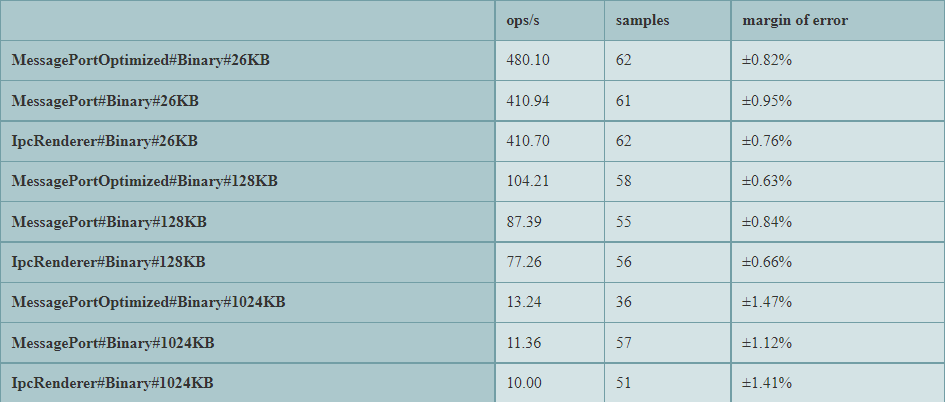
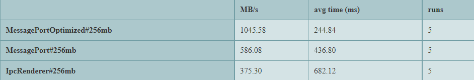

# Electron Ipc Tests

Benchmark testing the latency and throughput of [MessagePort](https://www.electronjs.org/docs/latest/api/message-port-main) vs [IpcRenderer](https://www.electronjs.org/docs/latest/api/ipc-renderer) for inter-process communication. 

## How to run

1. Install
```
pnpm i
```
2. Start
```
pnpm start
```
3. Wait for all three tests to complete (a few mins)

## Interpreting Results

Three tests will run and each will produce a chart. The format of the names on the left side of each chart is `[HowTheMessageWasSent]#[MessageFormat]#[SizeOfMessage]`. `op/s` is the number of operations the test ran per second (higher is better). `Mb/s` is the number of Megabytes transferred per second. 

### Binary Latency Test

The first test measures the time it takes to send a binary ([UInt8Array](https://developer.mozilla.org/en-US/docs/Web/JavaScript/Reference/Global_Objects/Uint8Array)) message round-trip (mimicking `ipcRenderer.invoke`, i.e., Process A -> Process B -> Process A).
The test is repeated a number of times until an accurate measure is obtained.



Results: `MessagePort` is almost 40% faster than `IpcRenderer` for large binary payloads, but only 5-10% faster for smaller payloads.

### JSON Latency Test

The second test is the same as the first but the payload type is a random JSON object instead of UInt8Array.


Results: `MessagePort` is significantly faster than `IpcRenderer` for all JSON payloads. The larger the payload, the greater the difference (more than twice as fast for payloads of 500 kb).

**Side Note**: Notice how for the same sized payload (26 Kb), the `MessagePort` is about 30% faster sending binary rather than JSON. But for `IpcRenderer`, the difference is much greater &mdash; `IpcRenderer` is more than twice as fast sending binary data than JSON.

### Throughput

The last test measures how fast the backend can send data to the frontend one-way (i.e., Backend -> Renderer). All data is split up into 1 MB UInt8Array chunks. **I am not including the time it takes to create the data. Only the time it takes to go from A to B**.
`MessagePortOptimized` - takes advantage of PostMessage API to [transfer the binary data instead of copying it](https://developer.mozilla.org/en-US/docs/Web/API/Worker/postMessage#syntax).  




Results: `MessagePort` is ~50% faster than `IpcRenderer` at sending binary data from backend to frontend. `MessagePortOptimized` of course is the fastest.

**Side Note: Notice how the loading spinner seems to stutter a bit during the test, thats because the main process gets blocked while creating the data for the IpcRenderer.**