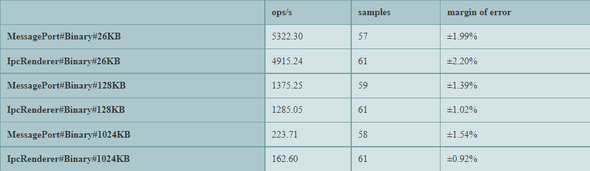
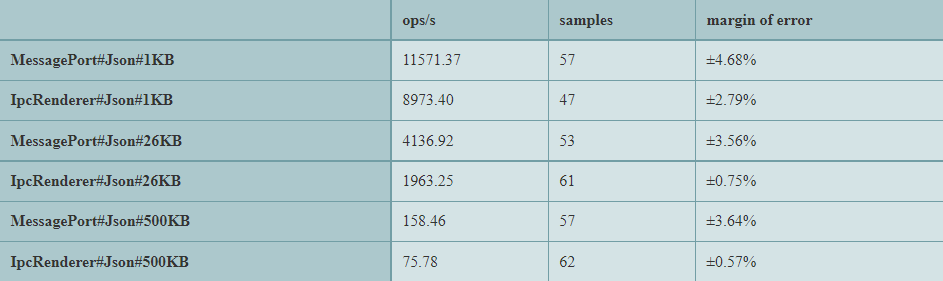

# Electron Ipc Tests

Testing the latency and throughput of [MessagePort](https://www.electronjs.org/docs/latest/api/message-port-main) vs [IpcRenderer](https://www.electronjs.org/docs/latest/api/ipc-renderer) for inter-process communication. 

## How to run

1. Install
```
pnpm i
```
2. Start
```
pnpm start
```
3. Wait for all three tests to complete (a few mins)

## Interpreting Results

Three tests will run and each will produce a chart. The format of the names on the left side of each chart is `[HowTheMessageWasSent]#[TypeOfMessage]#[SizeOfMessage]`. `op/s` is the number of operations the test ran per second (higher is better).  
`MessagePort` - [MessagePort.postMessage](https://www.electronjs.org/docs/latest/tutorial/message-ports/#worker-process).  
`MessagePortOptimized` - takes advantage of PostMessage API to [transfer the binary data instead of copying it](https://developer.mozilla.org/en-US/docs/Web/API/Worker/postMessage#syntax).  
`IpcRenderer` - `ipcRenderer.invoke` or `ipcRenderer.send` (depending on the test)

### Binary Latency Test

The first test measures the latency sending a binary ([UInt8Array](https://developer.mozilla.org/en-US/docs/Web/JavaScript/Reference/Global_Objects/Uint8Array)) message of varying size round-trip (i.e., Renderer -> Backend -> Renderer, or `ipcRenderer.invoke`).



Results: `MessagePortOptimized` is about 20% faster no matter the message size. `MessagePort` and `IpcRenderer` are pretty similar otherwise.

### JSON Latency Test

The second test measures the latency sending a json message of varying size round-trip (i.e., Renderer -> Backend -> Renderer, or `ipcRenderer.invoke`). JSON objects cannot be transferred like in the binary latency test.



Results: `MessagePort` is about twice as fast for larger messages and 50% faster for smaller messages.

### Throughput

The last test measures how fast the backend can send 512 MB to the frontend (i.e., Backend -> Renderer). All data is split up into 1 MB UInt8Array chunks. **I am not including the time it takes to create the data. Only the time it takes to go from A to B**.


Results: `MessagePort` is about 50% faster than `IpcRenderer`. `MessagePortOptimized` of course is the fastest.
**Notice how the loading spinner seems to stutter a bit during the test, thats because the main process gets blocked while creating the data for the IpcRenderer.**